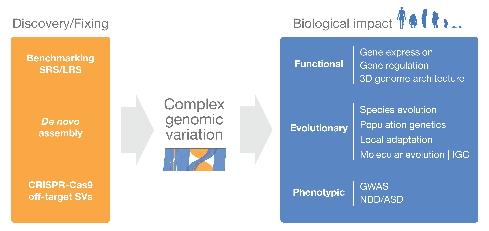

> _"Anything becomes interesting if you look at it long enough."_ ― Gustave Flaubert

> _“Everything is interesting if you go into it deeply enough.”_ ― Richard Feynman

My current research focuses on studying previously unexplored complex human variation—structural variation and segmental duplications—using a combination of both short- and long-read sequencing technologies to answer questions in regard to the evolution of our uniquely human features and diseases.

More generally, I'm interested in primate's complex genomic variation, including:
1. Improving its discovery and representation in reference genomes, and 
2. Assessing its functional, evolutionary, and phenotypic impact.

